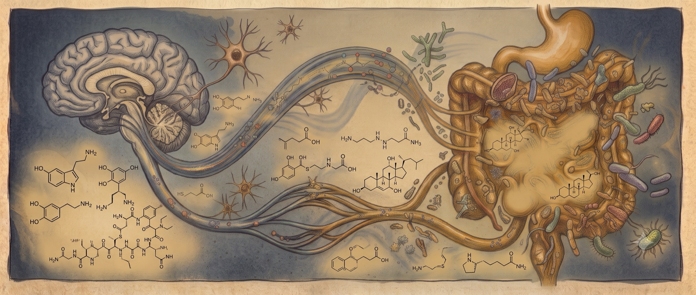

{fig-alt="Illustration of the gut-brain axis: a glowing brain and gut linked by signaling streams with microbiome cells" fig-align="center" width="100%"}

::: {.text-center}
<small>A stylized illustration of the gut-brain axis, used to introduce the case study. The image is illustrative and is not a data-derived result.</small>
:::

::: {.callout-note appearance="simple"}
**Objective.** Reanalyze a published ALS gut-microbiome dataset with DeepTaxa, validate the genus calls against an independent SILVA classification, and test whether species-level caution is warranted for this dataset.

**Prerequisites.** DeepTaxa (`pip install deeptaxa-rrna`), Python 3.10 or later, and pandas. The classification step uses a CUDA-capable GPU; the analysis below runs on CPU.

**Inputs.** ASV sequences and count tables from BioProject PRJNA566436, and the region-matched V4 DeepTaxa checkpoint.  **Outputs.** Genus-level concordance with SILVA, community-level comparisons between the ALS and control groups, and a revisited functional claim.  **Runtime.** A few minutes for the analysis on CPU; the ASV classification is precomputed and committed with the tutorial.

*Last validated July 2026.*
:::

This case study is a methodological demonstration of taxonomic classification and reproducibility. It is not intended for diagnosis, prognosis, treatment selection, or patient-level interpretation.

## Summary

Short-read 16S amplicons are easy to generate but difficult to classify confidently below
the genus rank, and the common advice is to treat species-level calls as unreliable. This case
study reanalyzes a published amyotrophic lateral sclerosis (ALS) gut-microbiome dataset with
DeepTaxa and evaluates whether that caution is warranted for this dataset. Using the region-matched
DeepTaxa checkpoint, 99 percent of reads receive a genus-level assignment, with a mean genus
confidence of 0.985. Because a confidence score is not the same as accuracy, the same
amplicon sequence variants (ASVs) were independently classified with SILVA: the two methods
agree on the genus of about 94 percent of reads. On that basis, the reanalysis recovers the
original study's community-level differences in the same direction and revisits a functional
claim that does not hold here. With only nine pairs, these observations are consistent rather
than conclusive.

The full pipeline, code, statistics, and figures are in the companion
[analysis notebook](casestudy/analysis.html).

The reanalysis follows the pipeline in @fig-cs-pipeline, from the raw reads to a comparison with the original study.

```{mermaid}
%%| label: fig-cs-pipeline
%%| fig-cap: "The reanalysis pipeline. DADA2 denoises the raw V4 reads into amplicon sequence variants, which DeepTaxa and SILVA classify independently. Alpha diversity and the PERMANOVA are computed from the count table alone, whereas the differential-abundance and functional analyses depend on the DeepTaxa taxonomy that the SILVA cross-check validates; both branches feed the comparison with the original study."
%%| echo: false
flowchart LR
    A["18 SRA runs<br/>(16S V4)"] --> B[DADA2 denoising]
    B --> C["276 ASVs<br/>and count table"]
    C --> D["DeepTaxa<br/>classification"]
    C --> E["SILVA<br/>cross-check"]
    D --> F["Genus concordance<br/>~94%"]
    E --> F
    C --> G["Alpha diversity<br/>and PERMANOVA"]
    D --> H["Differential abundance,<br/>F:B ratio, PICRUSt2"]
    F --> I["Compare with the<br/>original study"]
    G --> I
    H --> I
    style A fill:#f5efe4,stroke:#7a6343
    style B fill:#f5efe4,stroke:#7a6343
    style C fill:#f5efe4,stroke:#7a6343
    style D fill:#d6efe8,stroke:#1f6b4f
    style E fill:#d6efe8,stroke:#1f6b4f
    style F fill:#e4dced,stroke:#5a3d75
    style G fill:#d8e4f0,stroke:#2a5278
    style H fill:#d8e4f0,stroke:#2a5278
    style I fill:#f0e2d6,stroke:#994a2a
```

## The dataset and the question

The data come from a study in which each ALS patient was paired with their spouse as a
control, so that cases and controls share diet, household, and environment. The deposited
runs cover 9 of the 10 matched pairs, sequenced as 16S rRNA V4 amplicons (515F/806R) on an
Illumina MiSeq. The paired design suits a within-subject comparison, and the prior
characterization of the cohort makes it a useful test of whether a neural 16S classifier
can deliver reliable calls on short reads.

The dataset was published by @hertzberg2021als and is openly deposited under BioProject [PRJNA566436](https://www.ncbi.nlm.nih.gov/bioproject/PRJNA566436), which holds de-identified 16S sequencing data with no personal health information. The reanalysis below is a methodological demonstration and is not intended as clinical guidance.

## Classifying with DeepTaxa

These reads are V4, so the analysis uses the DeepTaxa checkpoint [@salah2026deeptaxa]. It
assigns a genus to 99 percent of reads at high confidence (mean 0.985). High confidence is not the same as
accuracy, however, because it reflects how well the input matches the model's training regime.
The next section checks the calls against an independent reference.

## Confirming the calls against SILVA

To test correctness rather than confidence, the 276 ASVs were independently classified with
the SILVA v138 reference [@quast2013silva]. After harmonizing GTDB and NCBI names, DeepTaxa
and SILVA agree on
the genus of about 94 percent of reads, and DeepTaxa assigns a genus name to a further 17.5
percent of reads that SILVA leaves at a higher rank. The genera underlying the findings
below are confirmed individually: *Prevotella*, *Blautia*, *Agathobacter*, *Parasutterella*,
and *Dorea* match directly, while *Phocaeicola* and *Mediterraneibacter* match SILVA through
documented synonyms (*Bacteroides* and the *[Ruminococcus] torques* group, respectively).
Two genera, *Acetatifactor* and *Hominicoprocola*, fall where SILVA stops at uncultured
placeholders and are therefore not independently confirmed.

## What the data show

Two of the findings are independent of the classifier because they are computed directly from the ASV count table:

- **ALS gut communities are more diverse** (@fig-cs-alpha). Observed richness and Shannon
  diversity are higher in ALS than in matched controls (p = 0.020), as is Simpson diversity
  (p = 0.027).
- **The communities are structurally distinct.** A Bray-Curtis PERMANOVA separates ALS from
  control (p = 0.015, or p = 0.004 when permutations are restricted to the matched pairs),
  with a clear gradient on the first principal coordinate.

```{python}
#| label: fig-cs-alpha
#| fig-alt: "Paired box plots of observed richness, Shannon, and Simpson diversity, ALS versus matched controls, with lines connecting each pair."
#| fig-cap: "Within-sample (alpha) diversity, ALS versus matched spouse controls. Each gray line joins a pair; boxes are colored by group. ALS communities are more diverse on all three metrics (paired Wilcoxon p-values shown). These metrics are computed from the amplicon sequence variant count table and do not depend on the classifier."
import numpy as np, pandas as pd
from scipy import stats
import matplotlib.pyplot as plt

meta   = pd.read_csv("casestudy/data/samples.tsv", sep="\t")
counts = pd.read_csv("casestudy/data/asv_counts.tsv", sep="\t", index_col=0)
rel    = counts / counts.sum(axis=0)
colors = {"ALS": "#d1495b", "Control": "#30638e"}

def shannon(c):
    p = c/c.sum(); p = p[p>0]; return float(-(p*np.log(p)).sum())

alpha = pd.DataFrame({
    "observed_ASVs": (counts>0).sum(axis=0),
    "shannon":       counts.apply(shannon, axis=0),
    "simpson":       1-(rel**2).sum(axis=0),
}).join(meta.set_index("sample")[["status","pair"]])

fig, axes = plt.subplots(1, 3, figsize=(9, 3.5))
for ax, m in zip(axes, ["observed_ASVs","shannon","simpson"]):
    bp = ax.boxplot([alpha[alpha.status==g][m].values for g in ["ALS","Control"]],
                    tick_labels=["ALS","Control"], showfliers=False, patch_artist=True)
    for patch, gname in zip(bp["boxes"], ["ALS","Control"]):
        patch.set_facecolor(colors[gname]); patch.set_alpha(0.35)
    piv = alpha.pivot_table(index="pair", columns="status", values=m, observed=True)
    for _, r in piv.iterrows():
        ax.plot([1,2], [r["ALS"],r["Control"]], color="gray", alpha=.5, lw=.8, marker="o", ms=3)
    a = alpha[alpha.status=="ALS"].set_index("pair")[m]
    c = alpha[alpha.status=="Control"].set_index("pair")[m]
    a, c = a.align(c, join="inner")
    ax.set_title(f"{m}\nWilcoxon p = {stats.wilcoxon(a,c).pvalue:.3f}")
fig.suptitle("Alpha diversity, ALS versus control (paired)", y=1.02); fig.tight_layout()
plt.show()
```

The confirmed taxonomy fills in the biological detail:

- **ALS is enriched in Clostridia** (36 versus 23 percent of reads, p = 0.027) and in
  Lachnospiraceae genera, including the butyrate producer *Agathobacter*, as well as
  *Blautia*, *Dorea*, and *Mediterraneibacter*.
- **ALS is depleted in *Prevotella*** (18 versus 44 percent), the dominant genus of the
  control microbiomes, a large effect in the same direction the original study reported.
- **The bulk Firmicutes-to-Bacteroidetes ratio is not different.** The Firmicutes split into
  a Clostridia fraction that rises in ALS and a Negativicutes fraction that rises in
  controls, and the two offset each other. The Clostridia enrichment is a specific class-level
  difference that the bulk ratio does not capture.

The genus-level differences are nominally significant but do not survive multiple-testing
correction at nine pairs, so they are best read as hypothesis-generating.

## Comparison with the original study

The reanalysis is consistent with the original study's community-level observations, now resting
on a classification that an independent reference confirms: ALS communities are more diverse and
structurally distinct from their matched controls. The depletion of *Prevotella* runs in the same
direction but does not reach significance here. The strongest functional claim of the original
study, that ALS patients lacked butyrate-metabolism genes, is not recovered here. A PICRUSt2 prediction [@douglas2020picrust2]
finds those genes present in every sample, with only a weak, non-significant trend toward
lower
butyrate-kinase-route capacity in ALS. That comparison is the most fragile on either side,
since it is a taxonomy-to-genome inference, and would require shotgun metagenomics to
settle.

## Takeaway

The reliability of short-read 16S taxonomy depends on the choice of classifier and
reference, and it can be checked rather than assumed. With the appropriate DeepTaxa
checkpoint, a V4 dataset that would normally be limited to phylum and class becomes
classifiable to genus, and an independent SILVA classification confirms those calls for the
relevant taxa. On that basis the reanalysis re-examines a published result and adds genus-level resolution to it. The diversity and community-level signals are consistent across methods, though the nine-pair cohort keeps them tentative; the genus and functional layers are exploratory and await a larger cohort.

## Reproducing this analysis

The companion [analysis notebook](casestudy/analysis.html) runs the ALS versus control
analysis from the committed ASV table and taxonomy tables, including the SILVA cross-check.
For full reproducibility from the raw reads, the scripts in [`casestudy/pipeline/`](https://github.com/systems-genomics-lab/deeptaxa/tree/main/tutorials/casestudy/pipeline) download
the 18 runs from the Sequence Read Archive and regenerate every table (ASV inference with
DADA2, classification with DeepTaxa and SILVA), so the case study can be reproduced from
step zero; the committed data lets readers skip straight to the analysis. The DeepTaxa
checkpoints are published at
[huggingface.co/systems-genomics-lab/deeptaxa](https://huggingface.co/systems-genomics-lab/deeptaxa).

## References

::: {#refs}
:::

---

::: {.d-flex .justify-content-between}
[← Previous: Validation](validation.qmd)

[Next: Training →](training.qmd)
:::
